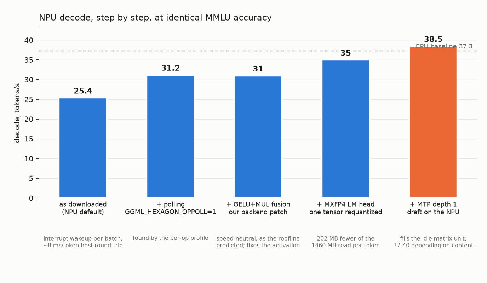
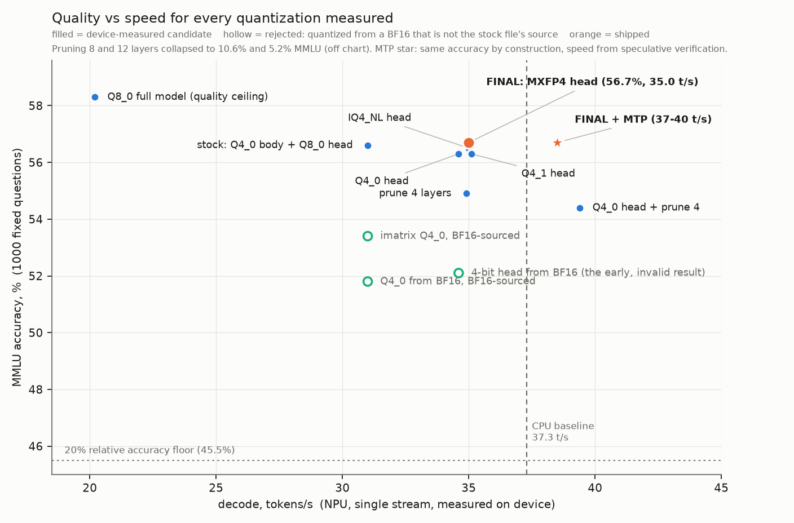

# Gemma 4 E2B on the Snapdragon 8 Elite NPU

Profiling-driven optimization of Gemma 4 E2B inference on the Hexagon NPU of the Snapdragon 8 Elite (the Galaxy S25
silicon), using llama.cpp's Hexagon backend. The work covers the full inference path: a bandwidth roofline and per-op
profile of the decode step, a code change in the backend, speculative decoding with the model's own multi-token head,
and a measured quality-versus-speed study across quantization formats and layer pruning. Every configuration is
evaluated on the same 1000 MMLU questions with paired significance tests, and the final configuration is reproducible
from pinned inputs and scripts.

## The result in one table

| | CPU baseline (stock 4-bit file) | NPU as downloaded | **NPU, optimized** |
|---|---|---|---|
| MMLU, 1000 questions | 56.9% | 56.9% | **56.7%** (not significantly different) |
| Decode, tokens/s | 37.3 | 25.4 | **37 to 40** |
| Prefill, tokens/s | 202 | 793 | **832** |
| Time to first token | 725 ms | 190 ms | **180 ms** |
| Peak RAM | 5123 MB | 1851 MB | **1641 MB** |
| Init to first token | 2.6 s | 3.0 s | **1.85 s** |

Accuracy comparisons: p is the paired McNemar p-value against the CPU baseline on the same 1000 questions; p > 0.05
means no detectable difference. Every row above has p >= 0.19 (the optimized row: 0.81).

Read it as: the NPU as delivered was faster than the CPU at prefill and lighter on RAM, but lost a third of its decode
speed to overheads and started up slower. After optimization it matches or beats the CPU on every row at the same
accuracy. (The CPU's init also drops, to 2.1 s, with the same `--fit off` flag; the 1.85 s row is compared against the
CPU as run by default.) Decode went from 25 to 37-40 tokens/s (+45 to 58%). All numbers are from the device, thermally gated, and
the optimized row was re-verified end to end on a second device unit.

**Hardware.** Qualcomm Device Cloud QRD board, SM8750 / Snapdragon 8 Elite / Hexagon v79, the Galaxy S25 silicon, platform
verified with `getprop` on every session (`ro.board.platform=sun`). **Runtime.** llama.cpp `ggml-hexagon` backend, pinned
commit `6a1a922`, built in the Snapdragon toolchain container, plus one patch of ours. **Model.** ggml-org
`gemma-4-E2B-it-Q4_0.gguf` (sha256-pinned): a 4-bit body with an 8-bit token-embedding that doubles as the LM head.

---

## 1. How everything was measured

- **Accuracy.** 1000 MMLU questions, fixed once (seed 42, all 57 subjects), zero-shot, Gemma's thinking mode disabled,
  scored by the top log-probability over A/B/C/D. Identical prompts for every configuration. Differences are tested
  with a paired McNemar test on the per-question results, so "56.7 vs 56.9" comes with a p-value, not a guess.
- **Speed.** A harness that waits until the hottest thermal zone is below 55 C, runs `llama-bench` and a 142-token
  completion, samples RSS on the device, and keeps the warm second run. Init is wall clock from process start to the
  first generated token.
- **Provenance.** Every run writes a JSON to `results/` (and a timestamped copy to `results/history/`); the pinned inputs,
  the patch and each script's expected output are in `REPRODUCE.md`.

## 2. Profiling: how the bottlenecks were found

This section is the heart of the report: five tools, in the order used, and what each one said.

**2.1 Bandwidth anchor.** `test-backend-ops` GEMV at Gemma's matrix shapes gives the NPU about 51 GB/s and the CPU
about 55 GB/s (measured at the 8-bit-head shape; the CPU's 4-bit GEMV runs slower at 42 GB/s, but its decode of 37.3 x 1.46 GB
implies it sustains ~54 GB/s across the whole step). A decode step reads about 1.46 GB of weights (35 layers plus the
428 MB head). That sets a hard ceiling near 35 tokens/s on the NPU and ~37 on the CPU. The CPU's 37.3 was already on it. Conclusion before touching anything:
**decode is memory-bandwidth bound; the NPU's 25.4 means it is losing 30% somewhere other than the math.**

**2.2 Per-op profile** (`GGML_HEXAGON_PROFILE=1`). Each matmul runs at 46-58 GB/s, i.e. ~90% of the ceiling. There is
no kernel headroom in the matmuls. The small elementwise ops (norms, adds, activations) total 2.9 ms of a 40 ms
step, 2-3 us each. Summed NPU-busy time is 31.8 ms; the step is 39.7 ms. **About 8 ms per token is spent outside
the NPU.**

**2.3 Batch and op-stream dump** (`GGML_HEXAGON_VERBOSE=1`). The decode graph is submitted as two batches per token,
each completed by an interrupt-signalled round trip. That is where the 8 ms goes. The same dump, read by op type
rather than by time, showed two things the profiler cannot: Gemma's 35 per-layer gate activations are emitted as
separate GELU and MUL ops that never reach the backend's fused GEGLU kernel, and the standalone NPU GELU kernel is
the quick approximation `x*sigmoid(1.702x)`, not the tanh-GELU the model defines.

**2.4 Byte accounting.** Of the 1.46 GB read per token, the 8-bit LM head is 428 MB, 29%, the single largest tensor
and the only one the vendor left above 4 bits. Batched runs confirmed the other half of the picture: the matrix
unit is idle at batch 1 (throughput scales 5x from 1 to 16 streams).

**2.5 Init timeline** (verbose load log with timestamps). The model's metadata and tensors are loaded twice: a
"fit parameters" dry run that then aborts because the layer count was set by hand, followed by the real load. Each
pass also spends 0.4 s parsing the 262k-token vocabulary.

## 3. Bottleneck to fix: five changes, each with its number

| # | Bottleneck (from) | Change | Decode | Other effect | Accuracy |
|---|---|---|---|---|---|
| 1 | Interrupt-signalled batch completion, ~8 ms/token (2.2, 2.3) | **Polling**: `GGML_HEXAGON_OPPOLL=1` | 25.4 to 31.2 (**+15 to 23%**) | one core spins: +15 C on sustained runs, no throttling | unchanged |
| 2 | Per-layer gates bypass the fused kernel; quick-GELU used for tanh-GELU (2.3) | **Backend patch**: fuse GELU+MUL into the existing GEGLU kernel (~100 lines, flag-gated) | 31.2 to 31.0 (neutral, as 2.2 predicted) | logits closer to the CPU reference: KL down 6%, top-token agreement +0.2 pt | unchanged, p=1.0 |
| 3 | Model loaded twice at startup (2.5) | **`--fit off`** | none | init 3.0 to 1.9 s (**-32%**) | unchanged |
| 4 | 8-bit LM head = 29% of bytes per token (2.4) | **Requantize one tensor** to MXFP4, from the stock file; 540 of 541 tensors byte-identical | 31.0 to 35.0 (**+13%**) | RAM -11%, prefill +3%, file -7% | 56.7%, p=0.81 |
| 5 | Matrix unit idle at batch 1 (2.4) | **MTP speculative decoding**, depth 1, draft on the NPU | 35.0 to 37-40 (**+5 to 14%**) | none | lossless by construction |

Stacked: 25.4 to 37-40 tokens/s. Three of the five are execution changes, one is a memory-access change, one is a
kernel-path code change. Notes on the two that need them:

- **The fusion (change 2)** was chosen knowing it would not move throughput. Section 2.2 had shown that every
  fusion candidate is worth under 1% of a step, below run-to-run noise, and the measured result was +0.3%. It was
  done because the op-stream dump showed the NPU computing the wrong activation for Gemma's per-layer gates. The
  fused GEGLU kernel already implemented the correct tanh form; the patch routes the pair to it. It fires on 34 of
  35 layers per token (layer 0 is split by a host synchronize) and is verified with a same-binary A/B via a new
  flag bit. It is the one change inside the backend, and a prediction ("speed-neutral") that came true is evidence
  that the roofline analysis was right.
- **MTP (change 5)** initially aborted. The cause was placing the draft model on the CPU: Gemma's MTP head shares
  the target's KV cache, so the draft must run on the same device. Once placed on the NPU it works at 46-61%
  acceptance. Depth 2-3, confidence gating, an 8-bit drafter and n-gram hybrids were all measured and sit within
  noise of depth 1: acceptance is fixed by the drafter Google trained. Upstream's only published Hexagon number for
  this model is 14 tokens/s with MTP (Galaxy S26+, llama.cpp PR #24282, so not the same silicon); this configuration
  is at 37-40.

## 4. Quality versus speed: the whole trade-off space

Accuracy can be traded for speed on a bandwidth-bound model, so every option was measured rather than assumed.

| Option | MMLU | Decode | Verdict |
|---|---|---|---|
| 8-bit everything | 58.3% | 20.2 | +1.4 pt that 1000 questions cannot confirm (p=0.19), for half the speed and +80% RAM |
| Stock 4-bit, 8-bit head | 56.9% | 31.0 | the starting point |
| 4-bit head: Q4_0 / IQ4_NL / Q4_1 | 56.3 / 56.5 / 56.3 | 34.6-35.1 | 0.3-0.5 pt (not significant), same speed as MXFP4 |
| **4-bit head: MXFP4** | **56.7%** | **35.0** | **free: accuracy-neutral and the smallest** |
| Prune 4 layers | 54.9% | 34.9 | -1.9 pt for the same +12%, and it disables MTP (acceptance falls to 5-10%) |
| Q4_0 head + prune 4 | 54.4% | 39.4 | -2.4 pt (significant), fastest plain decode, but MTP still disabled so slower than MXFP4 head + MTP |
| Prune 8 / 12 layers | 10.6 / 5.2% | | collapses without a healing fine-tune |
| imatrix 4-bit | 53.4% | = stock (identical bytes) | invalid, see below |

MMLU column: the 8-bit, stock and MXFP4/Q4_0-head rows are device runs; IQ4_NL, Q4_1, prune and imatrix rows are host
(Mac) runs of the same 1000 questions, used where no device run exists. Every variant scored on both agreed within
0.2 pt. Decode is on-device for every row.

**The best use of the accuracy budget was none of it.** One tensor requantized to MXFP4 buys the full byte saving
at zero measurable cost; everything past that is dominated. One methodological finding belongs here: the BF16 file
on Hugging Face is not the parent of the shipped Q4_0 (the norm tensors, which quantization never touches, differ
byte for byte, and the BF16 was re-uploaded months later), so every variant quantized from it scores about 5 points
low. That is why the early "4-bit head loses 4.7 points" result was wrong, and why the final head was requantized from
the stock file instead.

## 5. What else was measured

| Study | Result |
|---|---|
| Context depth | decode 34.3 / 32.1 / 30.5 t/s at 512 / 2048 / 8192 tokens: Gemma's shared KV keeps it nearly flat |
| Prompt length | NPU prefill lead over the CPU grows from 4.0x at 128 tokens to 6.8x at 2048 |
| Multi-user serving | 144 t/s aggregate at 16 streams (3.9x the CPU's single stream); the head change adds nothing here, as expected |
| Sustained load | 5 back-to-back 1024-token runs lose <1%; polling runs 15 C hotter than interrupt mode, neither throttles |
| End-to-end latency, 128-token reply | CPU 4.2 s, NPU as downloaded 5.2 s, NPU optimized 3.4-3.6 s (TTFT + 128 / decode rate, from the main table) |
| Energy per token | not measurable: the QDC board exposes no live power counters; the script is ready for a phone |

## 6. Closed with evidence

Tried, measured, and ruled out, so nobody repeats them: HMX off (prefill collapses 10x), HVX-only attention (prefill
halves), KV cache at 8 bits (slower), fewer HVX threads, moving the head to the CPU, VMEM / micro-batch / host-buffer
knobs (neutral), forcing the matrix unit for 2-row matmuls (-16 to -23%), two-session tensor parallel (does not load /
thrashes), the Adreno GPU backend (slower than both), imatrix (invalid source), pruning (above).

## 7. What remains

A DSP-side batched GEMV for 2-4 rows is the identified path from ~40 toward ~45 tokens/s with MTP; prefill runs the
matrix unit at ~30% of peak; both are kernel projects, not experiments. Two findings are upstream-worthy in llama.cpp:
the fusion, and skipping the fit dry run when nothing is left to fit.

## 8. Reproduce

`REPRODUCE.md` rebuilds every number from pinned inputs (commit, model hashes, the patch, each script with its expected
output). The final model is one `llama-quantize` command and the final launch flags are in the README.
